# Computers are cheap

===

# ?

<!--
We study the world so we can make better decisions,
build better things and satisfy our curiosity.
-->

---

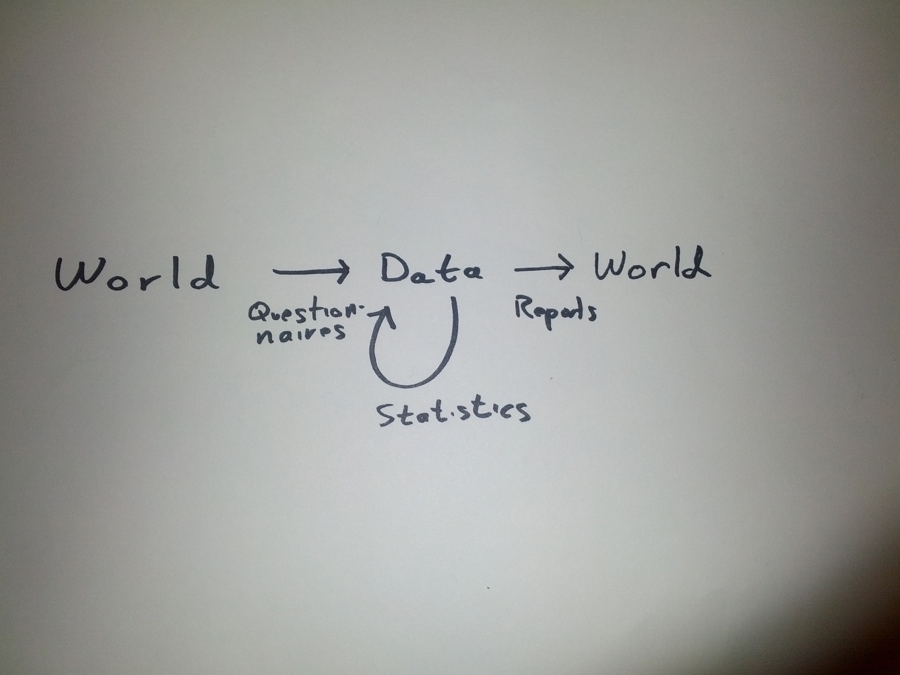

<!-- This is how we in this room do it. -->

---

## World -> Data

```
Special Operations,2005,2006,2007,2008,2009,Total
Emergency Service,0%,0%,1%,1%,0%,2%
Harbor Unit,0%,0%,0%,0%,0%,0%
Aviation Unit,0%,0%,0%,0%,0%,0%
Taxi Unit,0%,0%,0%,0%,0%,0%
Canine Unit,0%,0%,0%,0%,0%,0%
Mounted Unit,0%,0%,0%,0%,0%,0%
Headquarters,0%,0%,0%,0%,0%,0%
Special Operations Division Total,0%,0%,1%,1%,0%,2%
Percent of All Subject Officers Against Whom Allegations were Substantiated,0%,0%,0.2%,0.3%,0%,0.1%
```

When I say "data", I'm talking about tables.

<!-- 
The world is complicated; we need to simplify it in
order to understand it. Representing the world as
tabular data is one way of doing that.
-->

---


## Data -> Data

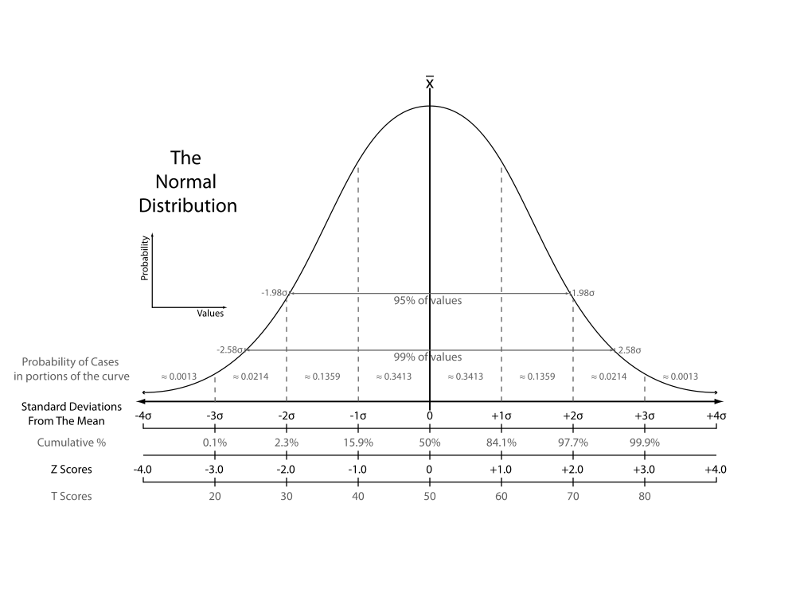


<!--
Sometimes the data are still too complicated, so we
simplify these data further with statistics.

http://upload.wikimedia.org/wikipedia/commons/thumb/2/25/The_Normal_Distribution.svg/1000px-The_Normal_Distribution.svg.png
-->


---


## Data -> World


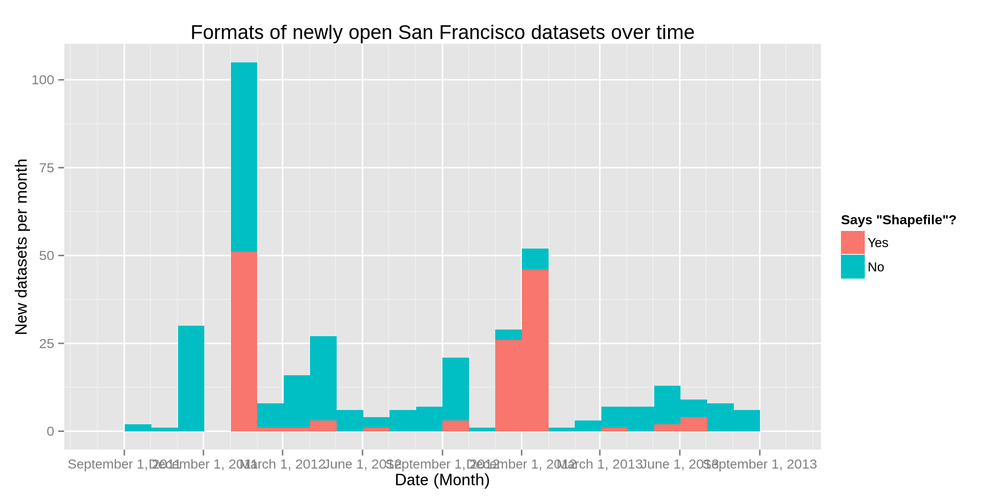


<!--

We simplify the data enough that we can understand it,
then we convert our data back into other things, like
papers and graphs.

-->


---


===


## Computers are cheap. How does that change things?

---

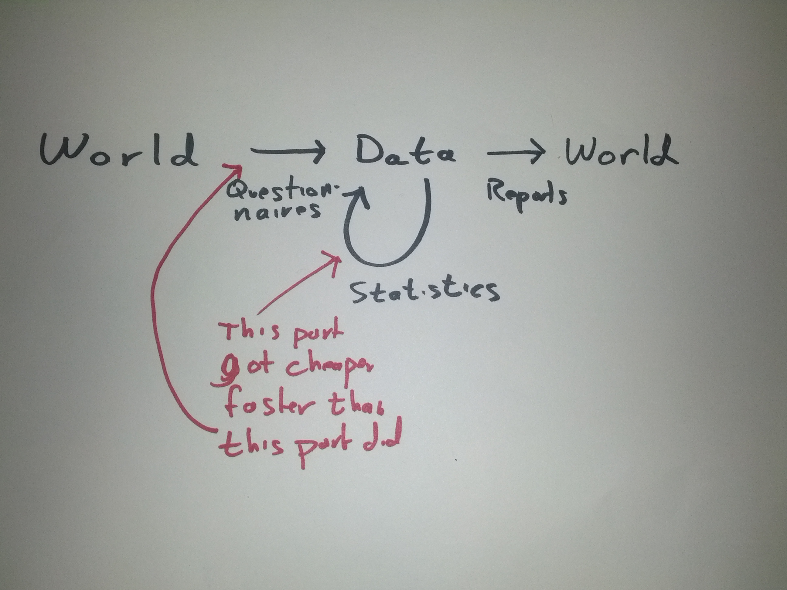


(Remember, "data" are tables.)

<!--

Some things got cheap faster than other things did.

-->
---

### Tradeoffs

Lots of automatically collected data

* More power
* Simpler models
* Not the exact data we want
* More work to store and process
* Less external validity

---

# World -> Data

<!--
Now it's super cheap to collect data, sometimes.
We collect the data practically for free by measuring things that are already happening.
We don't worry too much about designing a research plan. We wind up with
very large, often complete, historical data.
Here are some convenient/inexpensive data collection approaches.

-->

---

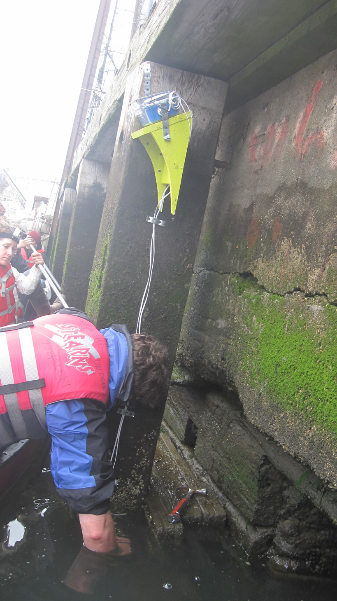

http://dontflush.me/420

---


---

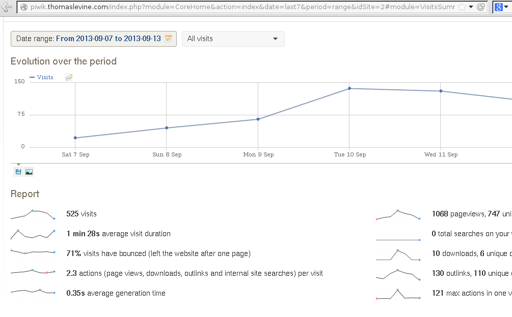

---

# Data -> Data

<!--
We decided to collect more data because it was cheap.
The resulting data are far more complicated than the data
coming out of questionnaires, so we need to do more statistics
and data transformations.
-->


---

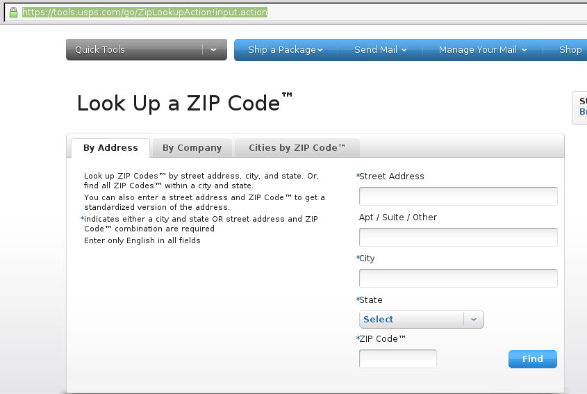

---

[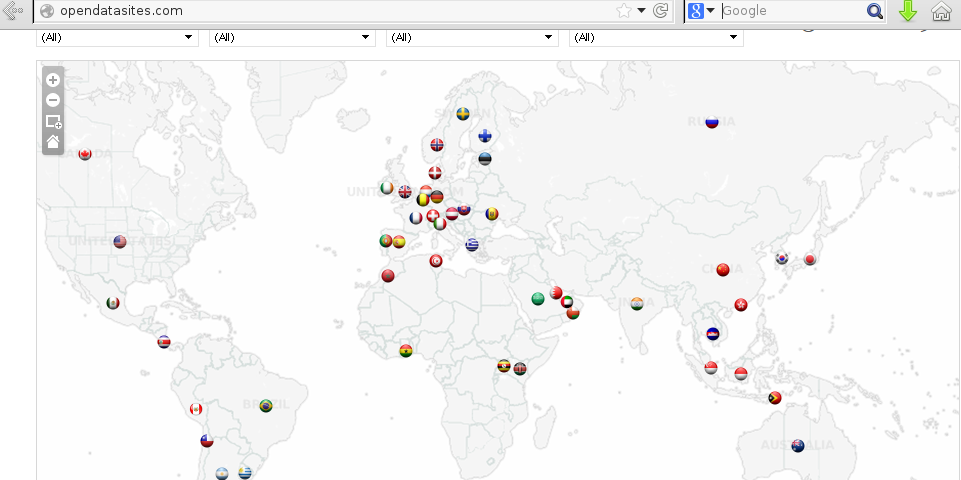](http://opendatasites.com/)

---

[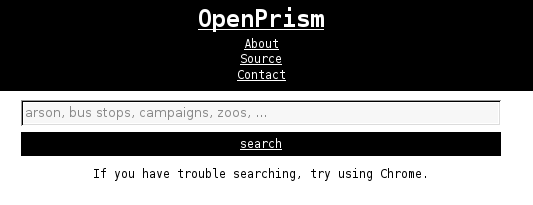](http://openprism.thomaslevine.com/)

---

# Data -> World

---

[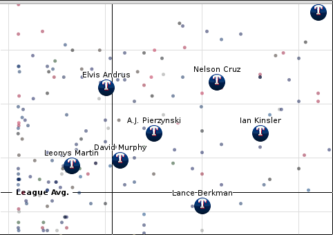](http://www.nytimes.com/interactive/2013/08/02/sports/baseball/bang-for-your-buck.html)

---

* Google
* Yelp
* Foursquare
* Facebook
* Twitter
* ...

---

[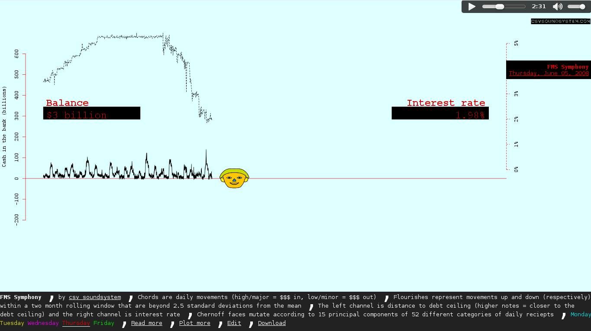](http://fms.csvsoundsystem.com)

===

# Creating meaningful datasets

---

## A text search is not statistics

---

## Designing experiments with Social media data

<!--
Collecting everything is akin to turning on a
security camera; we get all of the information
about the place where the camera is pointing
over time. If we want to know about other locations
or about specific times, we have to process
the stuff we collect to fit our curiousity.
-->

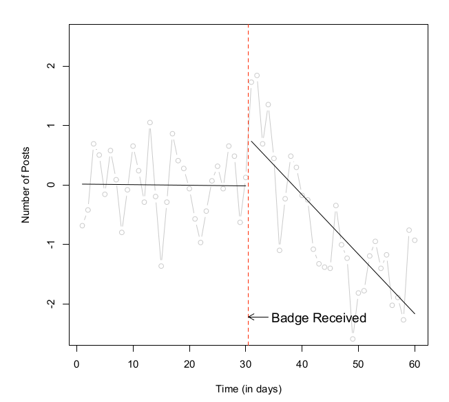

http://snap.stanford.edu/soma2010/papers/soma2010_1.pdf

---

## Control group

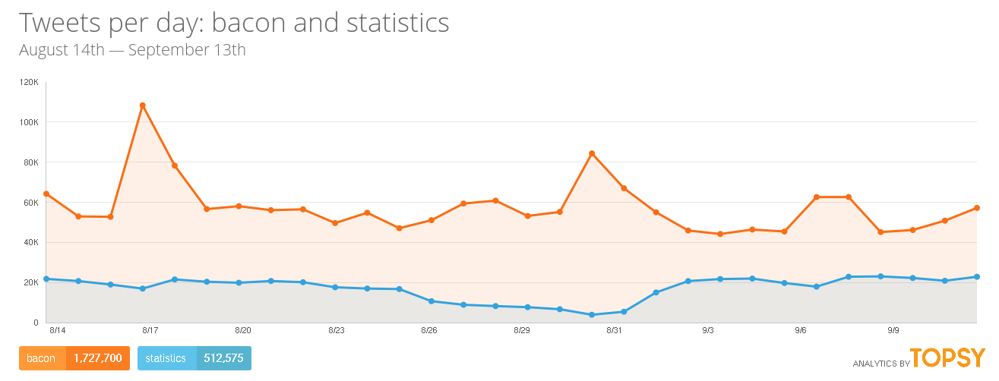

http://topsy.com/analytics?q1=bacon&q2=statistics&via=Topsy

---

## Be careful: Sampling bias

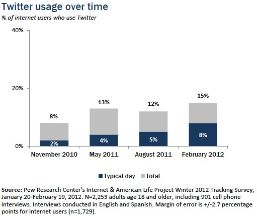

http://pewinternet.org/Reports/2012/Twitter-Use-2012/Findings.aspx

---

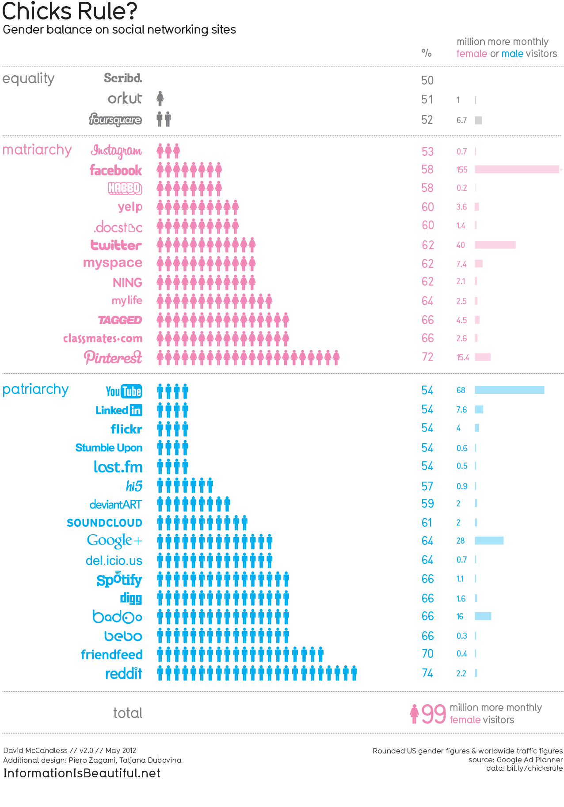

http://www.informationisbeautiful.net/visualizations/chicks-rule/

---


People tweet about things they're comfortable sharing.

http://harmony-institute.org/therippleeffect/2012/10/12/1265/

---

## Predict other variables: Fancy post-stratification

---

[](https://hackpad.com/Measuring-Socioeconomic-Indicators-in-Arabic-Tweets-IZ5ByP2LvIt)

---


http://www9.georgetown.edu/faculty/tannend/book_you_just_dont.html

---

	Recently you requested personal assistance from our on-line support
	center. Below is a summary of your request and our response.

	We will assume your issue has been resolved if we do not hear from you
	within 48 hours.

	Thank you for allowing us to be of service to you.

	To access your question from our support site, click the following
	link or paste it into your web browser.
	https://ask.census.gov/app/account/questions/detail/i_id/186591


	Subject
	---------------------------------------------------------------
	What proportion of people have middle initials?


	Discussion Thread
	---------------------------------------------------------------
	Response Via Email(CLMSO - EMM) - 03/14/2011 16:04
	Thank you for using the US Census Bureau's Question and Answer Center. Un-
	fortunately, the subject you asked about is not one for which the Census
	Bureau collects data. We are sorry we were not able to assist you.


	Question Reference #110314-000041
	---------------------------------------------------------------
	 Category Level 1: People
	 Category Level 2: Miscellaneous
	     Date Created: 03/14/2011 15:29
	     Last Updated: 03/14/2011 16:04
		   Status: Pending Closure
		       Cc:

---

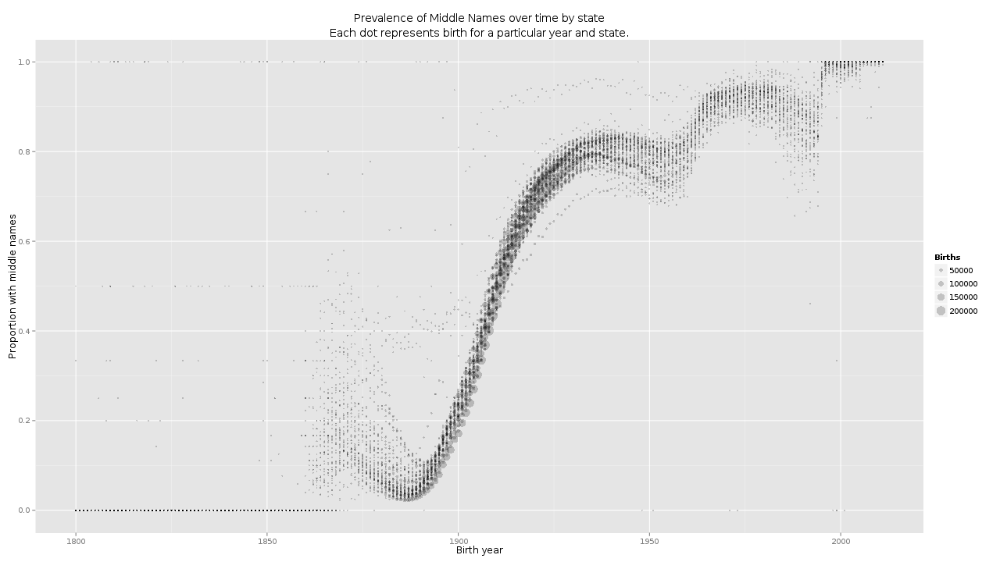

Age

http://thomaslevine.com/!/middle-names

---

Occupation/specialization

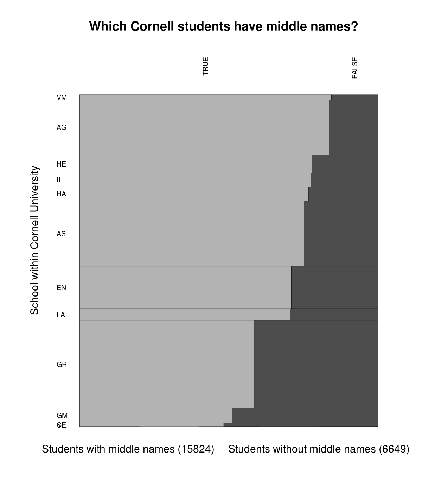

http://thomaslevine.com/!/middle-names

# One more thought

The power of linking

* Twitter user
* User profile
* Lots of tweets
* Links to websites

===

# Computers are cheap

* Computers are cheap,
* so we collect a lot more data,
* so we can do a lot more with it,
* but we have to process it more,
* and we still have to do good statistics.
